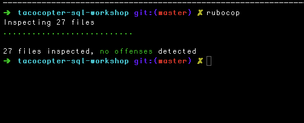
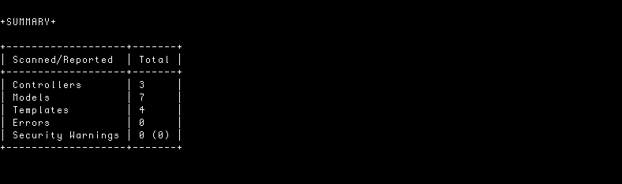

TACOJET
=========

### Demo of Sane Query's with has_many :through Relationships.

* Ruby v.2.2.2p95
* Rails v.4.2.5.2
* PostgreSQL v.9.4.3

## Development and test gems:

```ruby
group :development, :test  do
  gem 'pry-rails', '0.3.4'
  gem 'pry-byebug', '3.3.0'
  gem 'rails_best_practices'
  gem 'rubocop', require: false
  gem 'brakeman'
  gem 'awesome_print'
  gem 'rack-mini-profiler'
end
```
## Test gems

```ruby
group :test do
  gem 'minitest-rails'
  gem 'minitest-rails-capybara'
  gem 'poltergeist'
  gem 'shoulda-context'
  gem 'shoulda-matchers', '~> 3.1.1', require: false
  gem 'minitest-reporters', '~> 1.1.8'
  gem 'simplecov', require: false
end
```
### Testing

Testing by minitest. Run tests with 

```
$ rake
```
at command line. I actually run targeted tests with **vim** in a
Tmux session, using the **vimux** and **vim-test** plugins. This in 
combination with Zeus (which I favor over Spring) creates a very
agile testing environment. 

### Optimization

This app is not optimized: YAGNI
If it grew significantly fragment caching would need to be implemented.

### Rubocop

 

### Brakeman


 

[Copyright]( http://jet.mit-license.org/ ) by Jerrold R Thompson 
